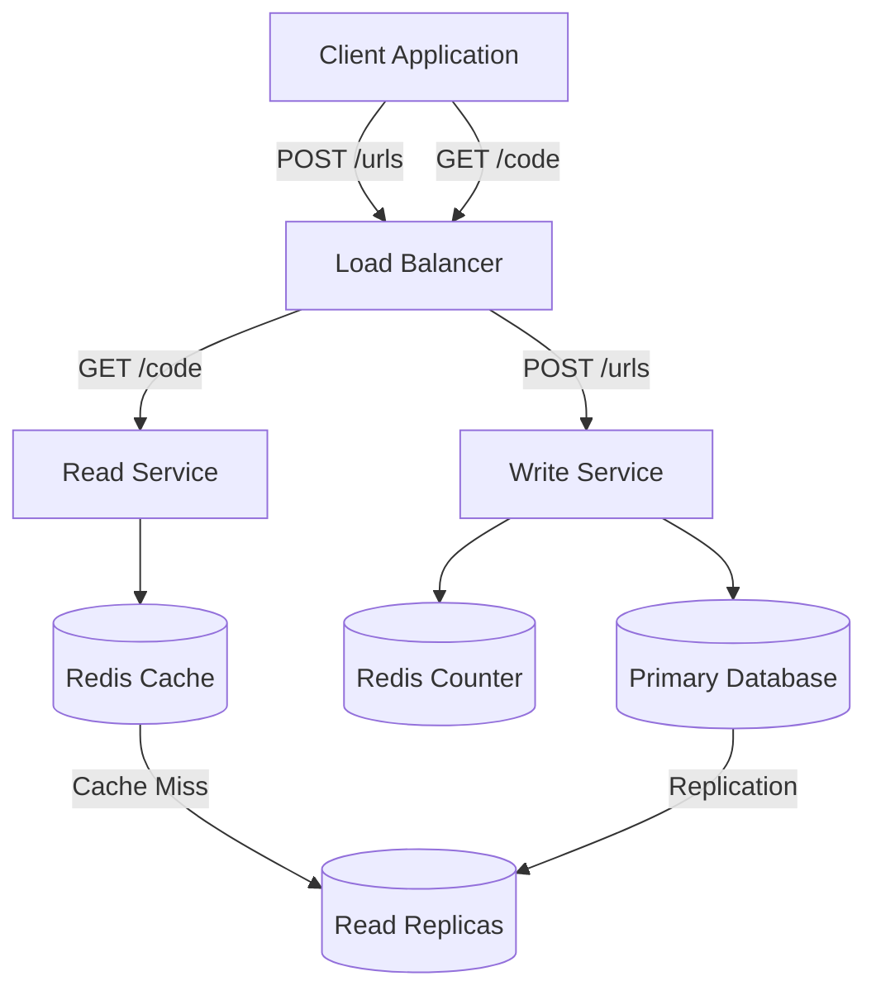
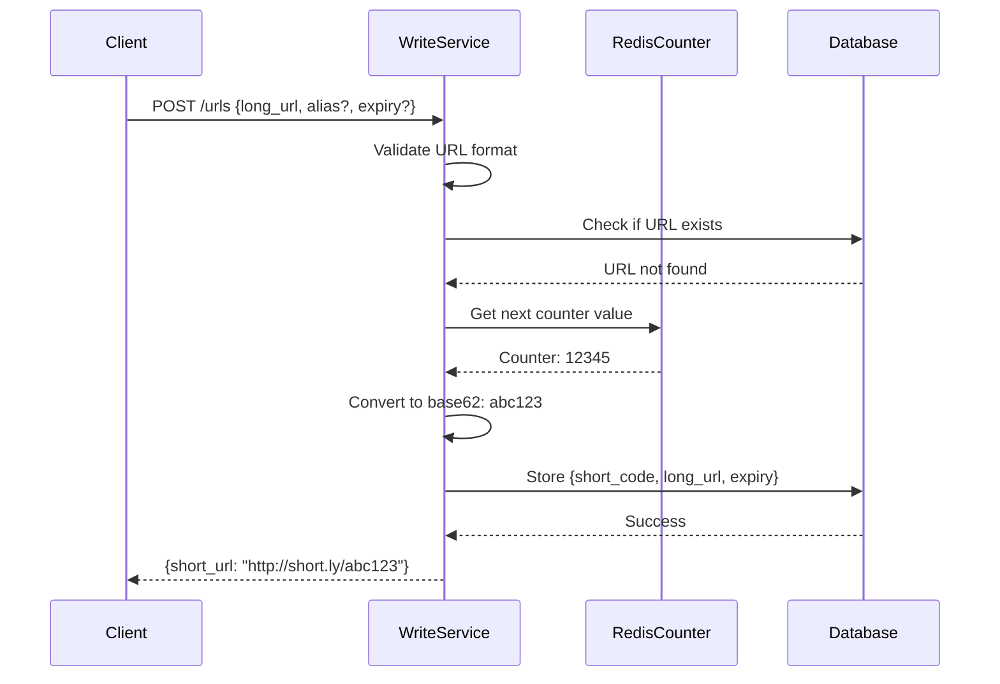
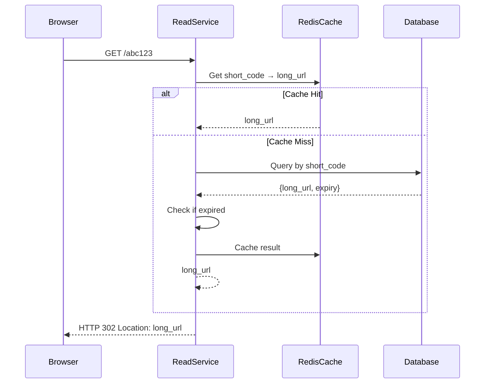
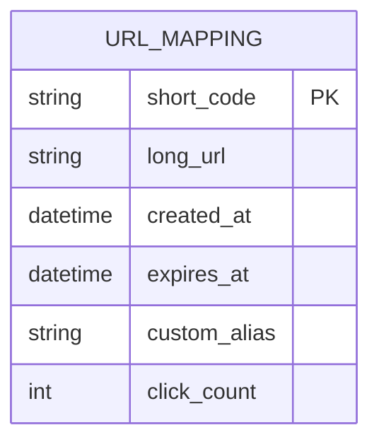
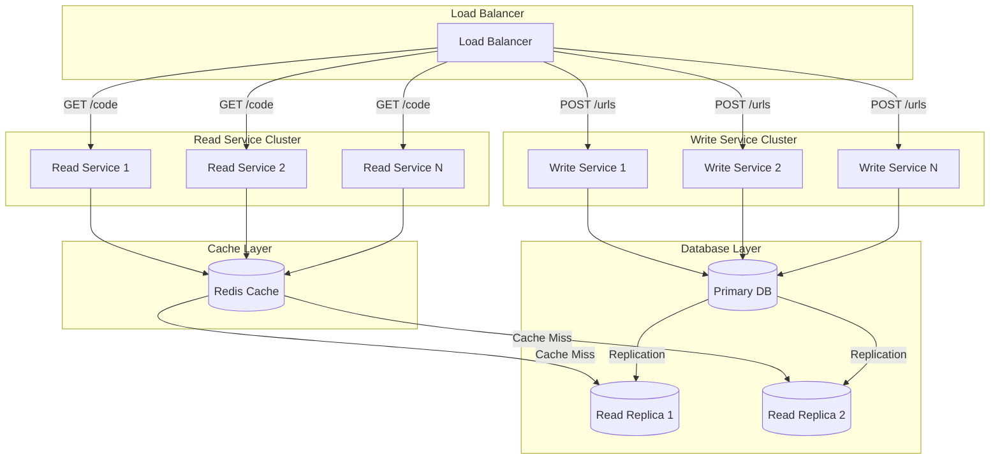
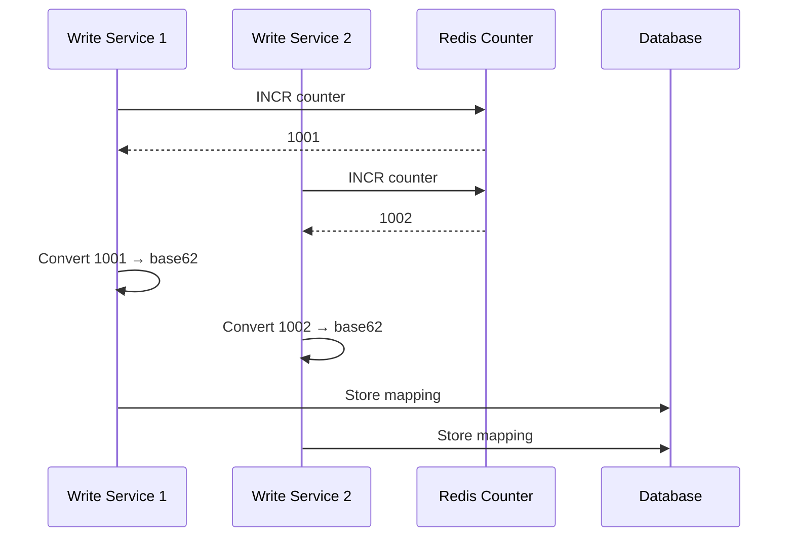
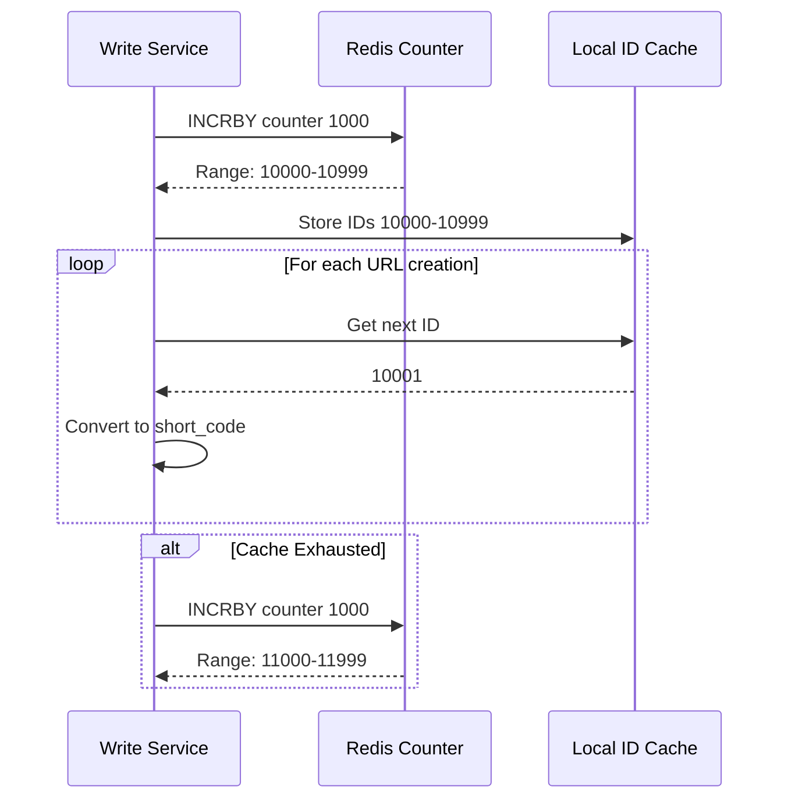
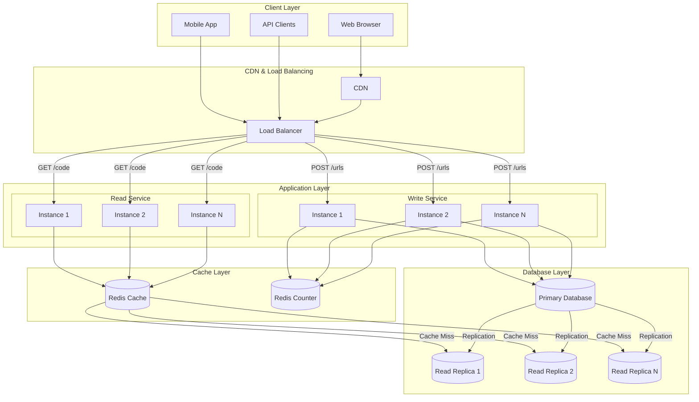

## URL Shortener – System Design Case Study

This document walks through the complete design: requirements → APIs → high-level architecture → deep dives → scaling.

### Table of Contents

1. [Requirements](#requirements)
   - [Functional Requirements](#functional-requirements)
   - [Non-Functional Requirements](#non-functional-requirements)
2. [Core Entities](#core-entities)
3. [API Design](#api-design)
4. [High-Level Design](#high-level-design)
5. [Deep Dives](#deep-dives)
   - [Short Code Uniqueness](#deep-dive-1-ensuring-short-code-uniqueness)
   - [Fast Redirects](#deep-dive-2-ensuring-fast-redirects)
   - [Scaling to 1B URLs](#deep-dive-3-scaling-to-1b-urls--100m-dau)
6. [Scaling Strategies](#scaling-strategies)
   - [Application Layer Scaling](#scaling-the-application-layer)
   - [Counter Problem & Solutions](#the-counter-problem-in-horizontal-scaling)
7. [Final Design Summary](#final-design-summary)

### Requirements

#### Functional Requirements

##### Core Requirements

1. Users can submit a long URL and receive a shortened URL.
2. Users may optionally specify:
   - a custom alias
   - an expiration date
3. Users can access the original URL using the shortened URL.

###### Out of Scope (Below the Line)

- User authentication
- Click analytics (geo, device, counts)
- Spam/malicious URL detection

#### Non-Functional Requirements

##### Core Requirements

- Short codes must be globally unique.
- Redirection latency < 100 ms.
- Availability > 99.99% (availability prioritized over consistency).
- Must scale to:
  - `1B shortened URLs`
  - `100M daily active users`
- Read-to-write ratio is extremely skewed:
  - ~1000 reads for every 1 write.

##### Out of Scope

- Real-time analytics consistency
- Advanced security or filtering features

### Core Entities

At this stage, only identify the main entities:

- `Original URL` – the long URL.
- `Short URL` – the short code + domain.
- `User` – creator of the URL (optional, out of scope).

Additional attributes will be added when designing the schema.

### API Design

#### 1. Create Short URL

`POST /urls`

Request:

```json
{
  "long_url": "https://example.com/very/long/url",
  "custom_alias": "optional_alias",
  "expiration_date": "optional_date"
}
```

Response:

```json
{
  "short_url": "http://short.ly/abc123"
}
```

- POST is used because a new resource (short URL mapping) is created.

#### 2. Redirect to Original URL

`GET /{short_code}`

Server response:

```
HTTP 302 Found
Location: https://original-long-url.com
```

We typically use `302 Temporary Redirect` instead of 301 because:

- Browsers won't cache it permanently.
- Allows expiry or updates to the link.
- Enables click tracking (even if analytics are out of scope here).

### High-Level Design

#### System Architecture



#### Flow: Create Short URL

`Components`

- `Client` – UI/mobile app.
- `Write Service` – business logic, validation, collision handling.
- `Redis Counter` – generates unique IDs.
- `Database` – stores mapping `{ short_code → long_url }`.

`Steps`

1. Client sends POST /urls with long URL and optional alias/expiry.
2. Write Service:
   - Validates URL format.
   - Checks if the long URL already exists.
   - Generates a unique short code (unless custom alias provided).
3. Store mapping in database.
4. Return short URL to client.



#### Flow: Redirect to Original URL

1. Browser sends GET /abc123.
2. Read Service queries:
   - First checks Redis cache.
   - On cache miss, queries database.
   - Check if short code exists.
   - Check if expired.
3. Return 302 redirect to original URL.



### Deep Dives

#### Deep Dive 1: Ensuring Short Code Uniqueness

`Requirements:`

- Unique codes.
- Codes should be short.
- Efficient to generate.

`Generation Strategies:`

1. `Counter-based`: Sequential counter converted to base-62 encoding
2. `Hash-based`: Hash of long URL (with collision handling)
3. `Random`: Random string generation (with collision checking)

(Actual generation strategies can vary: counters, hashing, base-62 encoding, etc.)

#### Deep Dive 2: Ensuring Fast Redirects

A full table scan is unacceptable at scale.

##### Pattern: Scale Reads

Given extremely high read volume:

- Use aggressive `caching`:
  - short_code → long_url mapping cached in Redis.
  - Cache hit rate should be > 90% for popular URLs.
- Use appropriate DB indexes on `short_code`.
- Avoid any expensive lookup on read path.

This drastically reduces latency and DB load.


#### Deep Dive 3: Scaling to 1B URLs & 100M DAU

##### Storage Requirements

Each row:

- short code: ~8 bytes
- long URL: ~100 bytes
- timestamps: ~16 bytes
- alias: ~100 bytes
- metadata: padding → assume ~500 bytes per entry

`1B rows → ~500 GB total`

A single modern SSD-backed DB instance can store this.

##### Database Schema



##### Write Throughput

Estimating ~100k new URLs/day → ~1 write per second.

Any mainstream DB (Postgres/MySQL/DynamoDB) can handle this easily.

##### Read Throughput

With 100M DAU and 1000:1 read-to-write ratio:

- ~100k reads/second peak
- Requires aggressive caching and read replicas

#### What if the Database Goes Down?

Options:

##### 1. Database Replication

- Multiple replicas maintain real-time copies.
- Failover if primary crashes.
- Read replicas handle read traffic.

##### 2. Database Backups

- Periodic snapshots to secondary storage.
- Point-in-time recovery capability.

This increases availability but adds operational complexity.

### Scaling Strategies

#### Scaling the Application Layer

Reads and writes have very different loads.

##### Split into Microservices

- `Write Service` – handles POST /urls
- `Read Service` – handles redirects (GET /{code})

Both can be horizontally scaled independently.

##### Microservices Architecture



##### Scaling Reads

Since reads dominate:

- Add caching (Redis) with high hit rate.
- Add read replicas for database queries.
- Possibly introduce CDN caching for redirect results.
- Horizontal scaling of Read Service instances.

#### The Counter Problem in Horizontal Scaling

If using `counter-based` short code generation:

- All Write Service instances must access a `single global counter`.
- This counter must avoid collisions across instances.

##### Solution: Redis Atomic Counter

- Redis is single-threaded and supports atomic increments.
- Works well for globally unique counters.

`Flow:`

1. Write Service calls Redis to get next counter.
2. Convert counter → short code.
3. Store mapping in DB.



#### Improving Performance: Counter Batching

To reduce overhead:

- Each Write Service instance requests `a batch of IDs` (e.g., 1000).
- Redis atomically increments by 1000.
- The instance uses these 1000 values locally.
- When exhausted, it requests a new batch.

`Benefits:`

- Fewer network calls.
- Reduced Redis load.
- Still globally unique.



##### Ensuring Availability

Redis replication or Redis Enterprise provides:

- Automatic failover
- High availability
- Data persistence

Counter can also be periodically persisted to durable storage.

### Final Design Summary

#### Complete System Architecture



#### Key Components

- `POST /urls` → generate short URL
- `GET /{code}` → redirect
- `Database` stores mappings
- `Redis Cache` caches read path (90%+ hit rate)
- `Redis Atomic Counter` ensures uniqueness
- `Microservices` separate read/write paths
- `Horizontal scaling` applies to both services
- `Batching` reduces counter load
- `Replication` increases availability