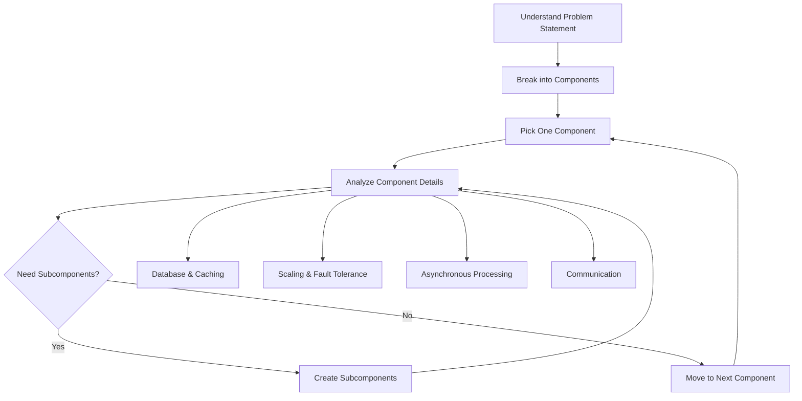
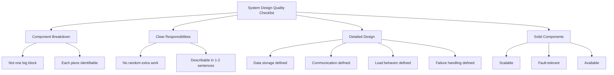

## What is System Design

System design is the process of deciding the overall architecture of a system:
- Identifying the main components and modules
- Defining what each component is responsible for
- Defining how these components interact with each other
- Making sure the whole thing works together to solve a specific problem

In short: What are the building blocks, how do they talk to each other, and why is this a good way to solve the problem?

## How to Approach

1. Understand the problem statement
   - What are we trying to build?
   - Who is it for?
   - What does it need to do (at minimum)?
   - What are the constraints (scale, reliability, performance, etc.)?

2. Break the problem into smaller components
   - Split the system into logical parts instead of thinking about it as one big block
   - Each component should represent one clear responsibility

3. Pick one component and go deeper
   - Take one component at a time and figure out how it will actually work
   - Do not stay at a high level forever

4. For each component, think about the following:
   - Database and caching  
     - What data does it store?  
     - Where is that data stored?  
     - What needs to be fast and can be cached?
   - Scaling and fault tolerance  
     - What happens when traffic increases?  
     - What happens when this component fails?
   - Asynchronous processing (delegation)  
     - What work can be handed off instead of done immediately?  
     - Can slow or heavy work be queued and processed later?
   - Communication  
     - How does this component talk to other components?  
     - What data is sent, and in which direction?

5. Add more subcomponents if needed
   - While going deeper, you may realize one "component" is actually multiple smaller parts
   - Create those smaller parts and repeat the same analysis for each of them

## How to Know You Have Built a Good System

1. The system is broken down into components
   - The design is not just one big block that "does everything"
   - You can point to each piece and say what it is

2. Each component has a clear set of responsibilities
   - No component is doing random extra work it should not be doing
   - You can describe any component in one or two sentences

3. For each component, details are figured out
   - Where does it store data?
   - How does it communicate?
   - How does it behave under load?
   - What happens if it crashes?

4. Each component, in isolation, is solid
   - Scalable: it can handle growth
   - Fault-tolerant: it can handle failures or recover from them
   - Available: it can keep working without causing the whole system to go down

If all of the above is true, the system design is on the right track.