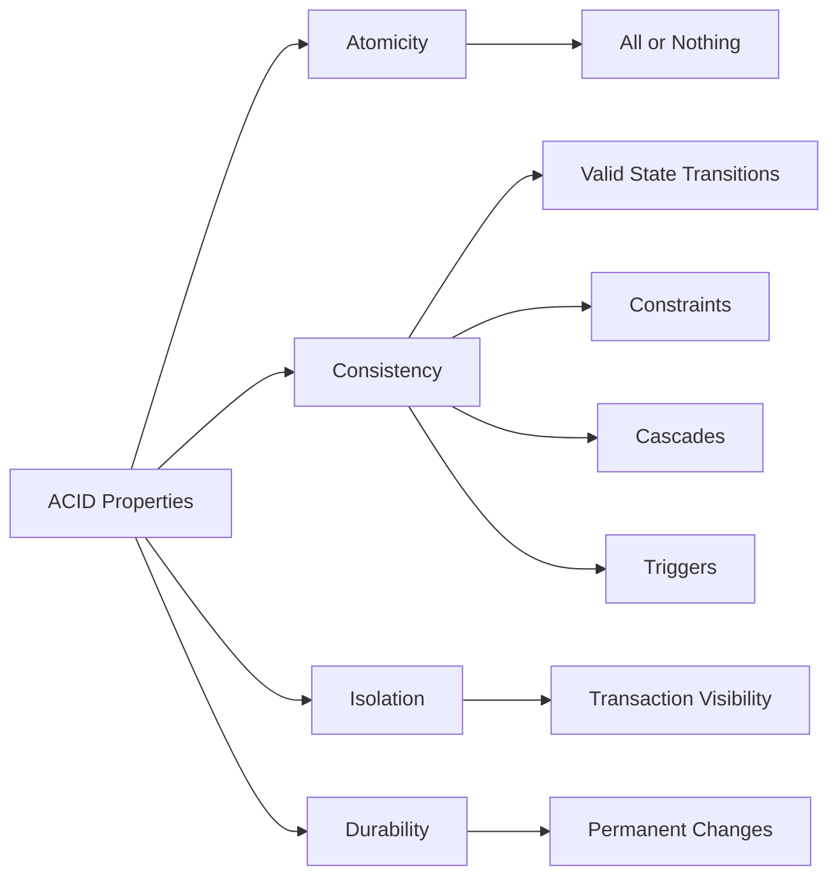
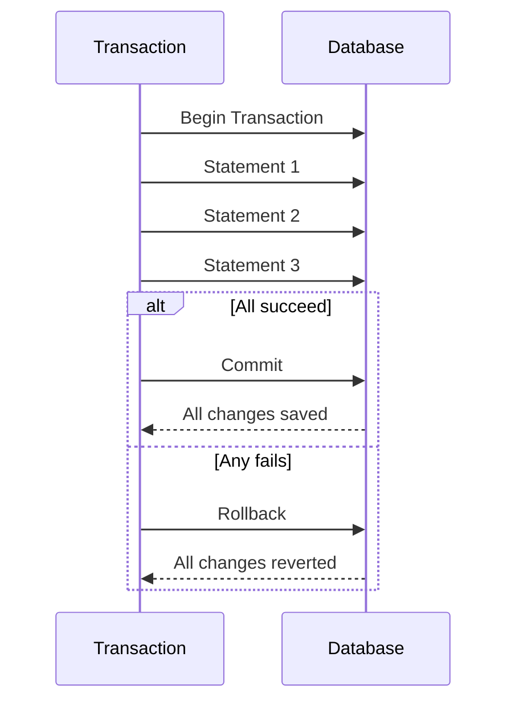
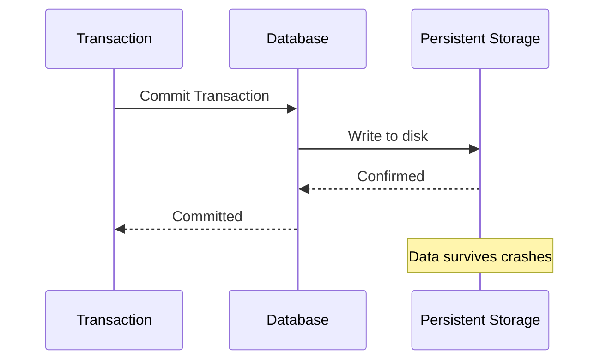

# Relational Databases

Relational databases store data in `rows and columns` (tables).  
They ensure `data consistency, durability, and integrity` through `ACID properties` and `constraints`.

---

## 🧩 ACID Properties

### 1. Atomicity
All statements within a transaction succeed or none do.  
→ No partial updates or half-completed operations.

### 2. Consistency
Data moves from one valid state to another.  
Ensured using:
- `Constraints` (e.g., foreign keys)
- `Cascades`
- `Triggers`

Example: A foreign key constraint ensures referential integrity.

### 3. Isolation
Determines how visible one transaction's changes are to others running simultaneously.

### 4. Durability
Once a transaction commits, the changes are permanent — they survive system outages or crashes.

