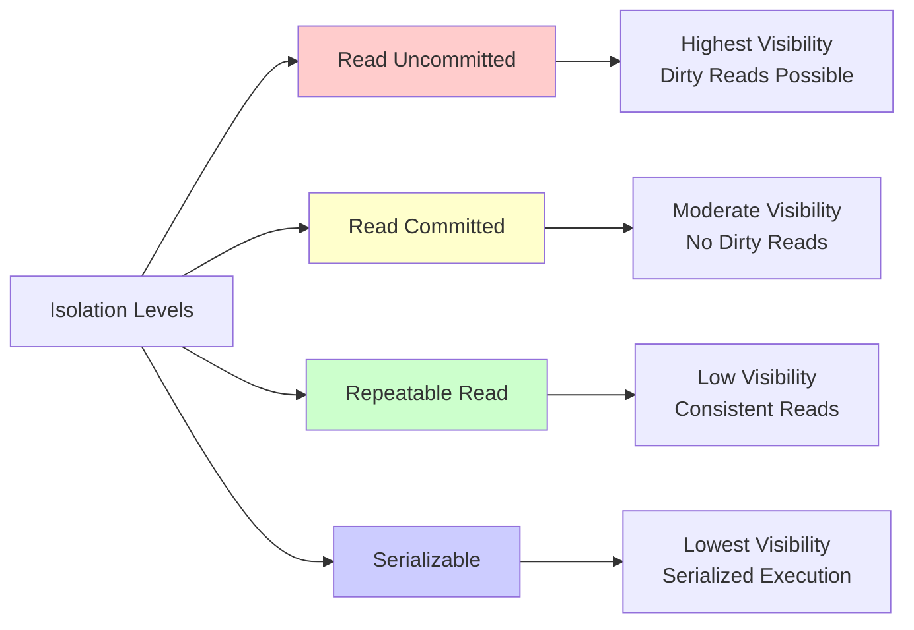
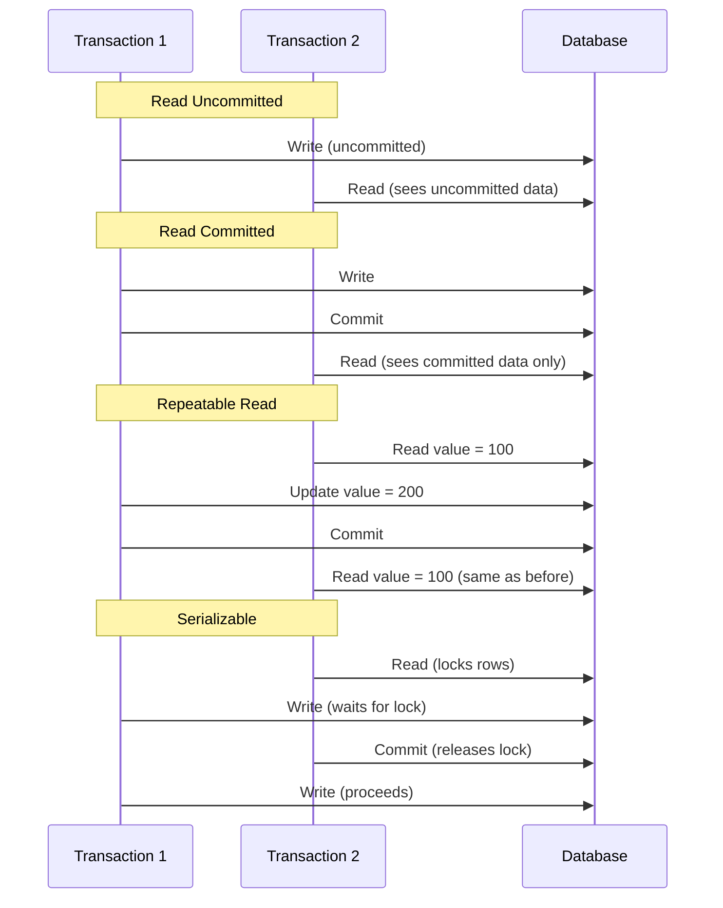

## Isolation Levels

Isolation levels decide how much one transaction knows about others that are running at the same time.

### Isolation Level Comparison

| Isolation Level     | Description | Visibility | Example Behavior |
|---------------------|-------------|------------|------------------|
| `Read Uncommitted` | Reads uncommitted values | Highest visibility | May see dirty reads |
| `Read Committed`   | Reads latest committed values | Moderate | Avoids dirty reads |
| `Repeatable Read`  | Ensures consistent reads in a single transaction | Low | Prevents non-repeatable reads |
| `Serializable`     | Every read locks rows | Lowest | Transactions run sequentially (like serialized) |

### Transaction Behavior Examples

### Important Notes

- Isolation levels impact `performance vs. consistency` trade-offs
- Storage engines (like InnoDB, RocksDB, etc.) can implement these differently — always `check the database documentation` for details

> Relational databases shine when you need `structured data with strong consistency` and `safe transactional behavior`.
