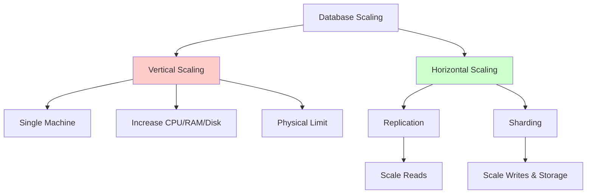
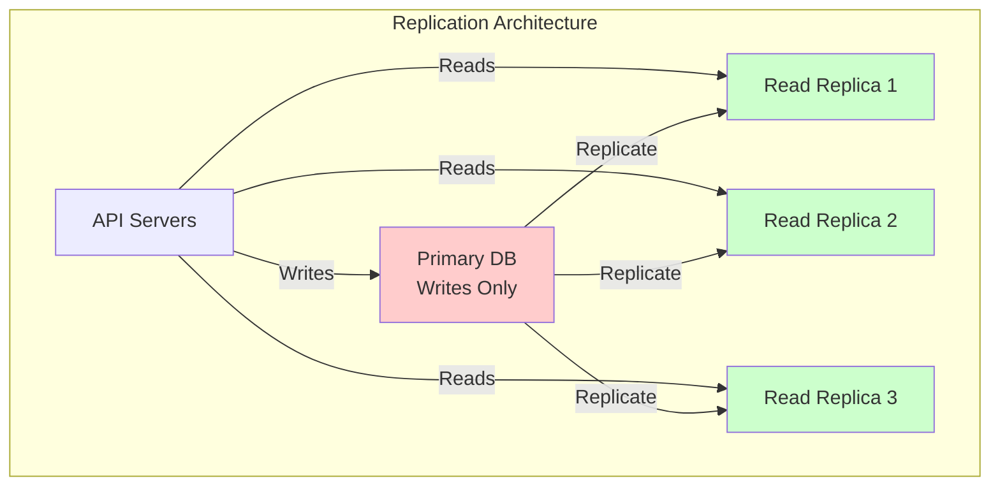
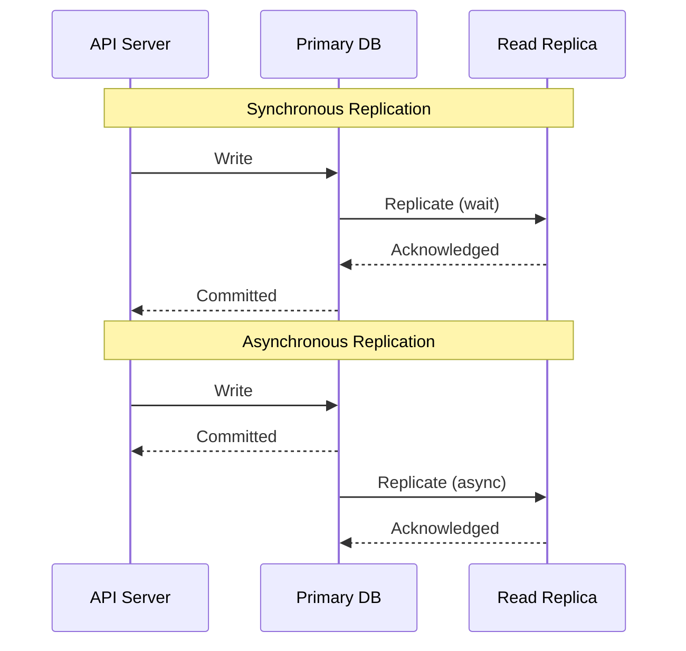
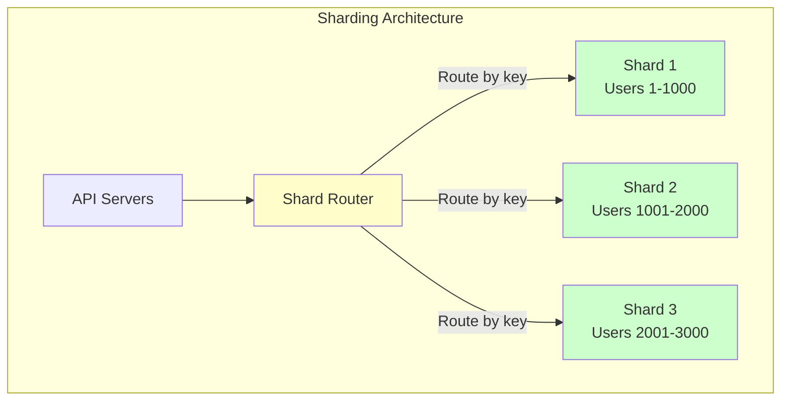
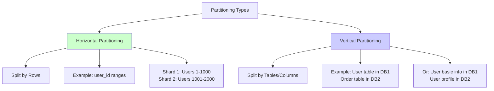

## Scaling a Database

### Overview
A database can be scaled in two ways:
- `Vertical scaling` — increase CPU, RAM, or disk on a single DB server.
- `Horizontal scaling` — add more DB servers using replication or sharding.

### Vertical Scaling
Vertical scaling means increasing the resources of the existing database machine.

`Characteristics`
- Add more CPU, RAM, or disk.
- Often requires downtime.
- Helps handle more load.
- Has a physical upper limit — you eventually hit the maximum capacity of a single machine.

`Example capacity growth`
100 WPS → 200 WPS → 1000 WPS → 1500 WPS (limit reached)

When the limit is reached, you must move to horizontal scaling.

### Horizontal Scaling with Replication
Replication is used to scale `reads`.

`How it works`
- Primary (master) DB handles all writes.
- Read replicas handle read traffic.
- When read:write ≈ `90:10`, replicas offload heavy read load.
- API servers should know which database to connect to for reads and writes.

`Replication types`

- `Synchronous replication`  
  - Strong consistency  
  - Zero replication lag  
  - Slower writes  
- `Asynchronous replication`  
  - Eventual consistency  
  - Some replication lag  
  - Faster writes  

Replication ensures changes on the primary DB are copied to replicas to maintain consistency.

### Horizontal Scaling with Sharding
Sharding is used when one database node cannot handle all the data or write throughput.

`How it works`
- Data is split into multiple `exclusive, independent subsets`.
- Each subset is stored in a different shard.
- Writes for a particular record always go to its shard.
- Shards operate independently; there is no replication between shards.
- API servers must know which shard to route requests to.
- Some databases provide a routing proxy that handles this automatically.
- Each shard can have its own replica if needed.

### Sharding vs Partitioning
- `Sharding` — distributing data across multiple machines.  
- `Partitioning` — splitting a dataset into smaller subsets (may be within one machine or multiple).

### How Horizontal Partitioning Helps
Once a single machine hits its limit, you can add more machines and split the load.

Example:
- A system handling 1500 WPS on one machine  
- Split into two shards → ~750 WPS each  

### Ways to Partition Data

- `Horizontal partitioning` — separating rows of a table (e.g., user_id ranges).  
- `Vertical partitioning` — separating tables or splitting columns into different DBs.

### Advantages of Sharding
- Supports large read and write volumes.
- Increases total storage capacity.
- Improves availability (shards are independent).

### Disadvantages of Sharding
- Operationally complex.
- Cross-shard queries are expensive.
- Rebalancing and moving data across shards is difficult.

`Always minimize cross-shard queries.`
