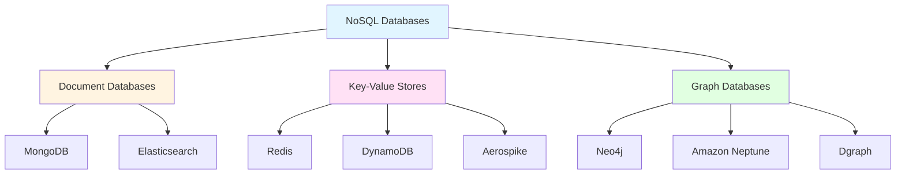
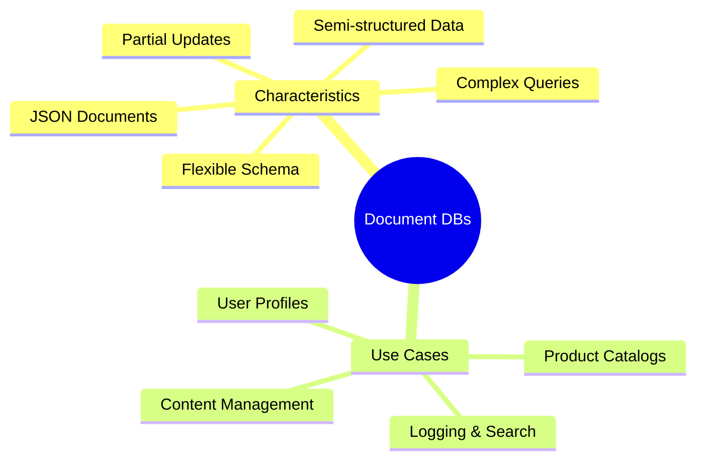
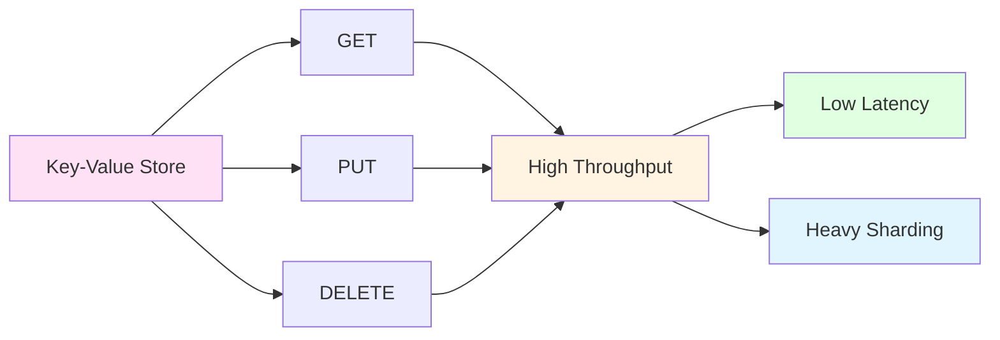
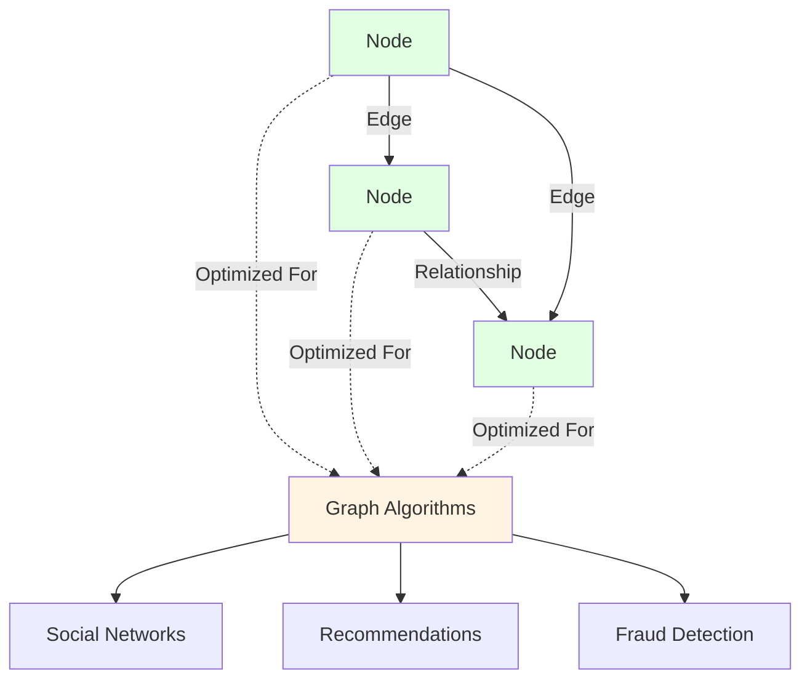

## Non-Relational Databases

Non-relational databases (NoSQL) do not follow the traditional SQL relational model.  
They are designed for flexible schemas and `horizontal scaling (sharding) out of the box`.

The three main categories are:

### Document Databases
`Examples:` MongoDB, Elasticsearch

`Characteristics`
- Store data as JSON or JSON-like documents.
- Support complex queries (similar to relational DBs).
- Allow partial updates to documents.
- Flexible schema; closest NoSQL type to relational databases.
- Good for unstructured or semi-structured data.

`Use cases`
- User profiles  
- Content management  
- Product catalogs  
- Logging and search (Elasticsearch)

### Key-Value Stores
`Examples:` Redis, DynamoDB, Aerospike

`Characteristics`
- Extremely simple model: `GET`, `PUT`, `DELETE`.
- Designed for key-based access patterns.
- Do not support complex queries (no aggregations or joins).
- Can be heavily sharded and partitioned.
- High throughput and low latency.

`Use cases`
- Profile data  
- Auth/session data  
- Caching  
- Order lookups  
- Real-time counters and leaderboards

> Relational DBs and document DBs can also be used as key-value stores if needed.

### Graph Databases
`Examples:` Neo4j, Amazon Neptune, Dgraph

`Characteristics`
- Represent data as `nodes`, `edges`, and `relationships`.
- Optimized for graph queries and graph algorithms.
- Extremely powerful for highly connected data.
- Ideal when relationships are first-class citizens.

`Use cases`
- Social networks  
- Recommendation engines  
- Fraud detection  
- Knowledge graphs  
- Network topology analysis
