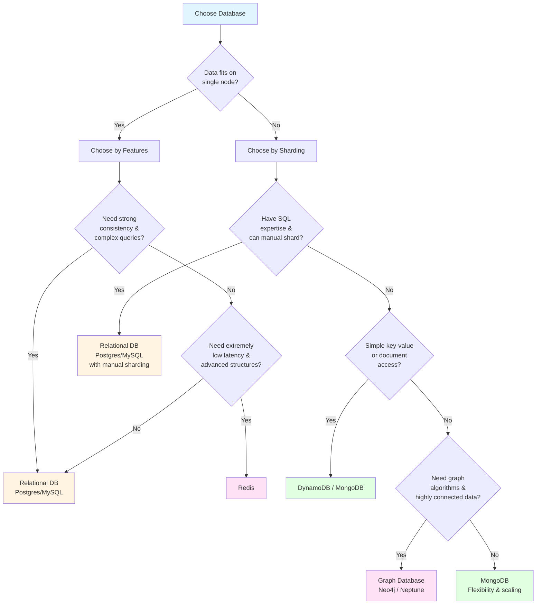
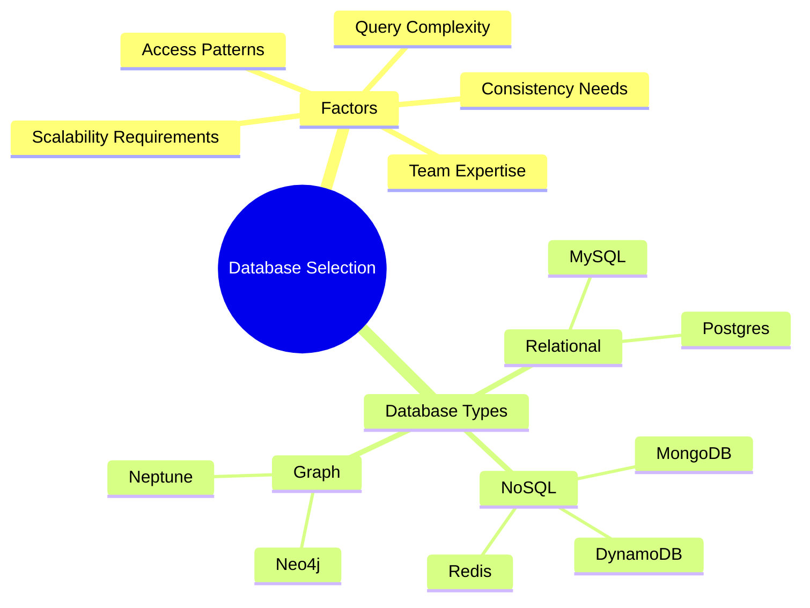

## Picking the Right Database

Choosing a database is not a fight between technologies. Each database is designed to solve a particular problem extremely well.

The goal is not to pick the "best" DB, but the `right DB for your workload`.

### Why Some Databases Scale and Others Don't

Relational databases struggle to scale horizontally because of:
- Strong relations
- Joins
- Constraints
- ACID guarantees

If you relax these:
- Avoid foreign key checks
- Avoid cross-shard transactions
- Perform manual sharding

…then relational databases can scale.

Non-relational databases are designed from the start to be `shard-friendly`, which is why they scale more easily.

### How to Pick the Right Database

Every database type offers unique properties and guarantees. You choose the DB whose guarantees match your requirements.

**Before choosing, understand:**
- What data are you storing
- How much data will be stored
- How the data will be accessed
- What the query patterns look like
- Any special features needed (e.g., TTL expiration)

### If the Data Fits on a Single Node

You can choose based purely on `features`:

#### Choose a Relational Database (Postgres, MySQL) if:

- You need strong consistency and correctness
- You need complex queries or aggregations
- You need structured data with relationships

#### Choose Redis if:

- You need key-based access with extremely low latency
- You need advanced data structures (sets, sorted sets, lists, streams)

### If the Data Does NOT Fit on a Single Node

Choose based on sharding capabilities and simplicity:

#### Choose a Relational Database (Postgres/MySQL) if:

- You have SQL expertise
- You can do manual sharding
- You're okay managing shard routing yourself

#### Choose DynamoDB / MongoDB if:

- You have simple key-value or document access patterns
- You want built-in horizontal scaling
- You don't need relational constraints

#### Choose a Graph Database (Neo4j, Neptune) if:

- You need sophisticated graph algorithms
- Your data is highly connected (nodes, edges, relationships)

#### Choose MongoDB if:

- Nothing special is required
- You want flexibility and future-proof scaling
- You want schema-less storage with easy horizontal scaling

### Summary

Pick the database that aligns with:
- Your consistency needs
- Your access patterns
- Your query complexity
- Your scalability requirements
- Your team's expertise

**Key Principle:** There is no "one best database." There is only the `best database for your system's specific needs`.
