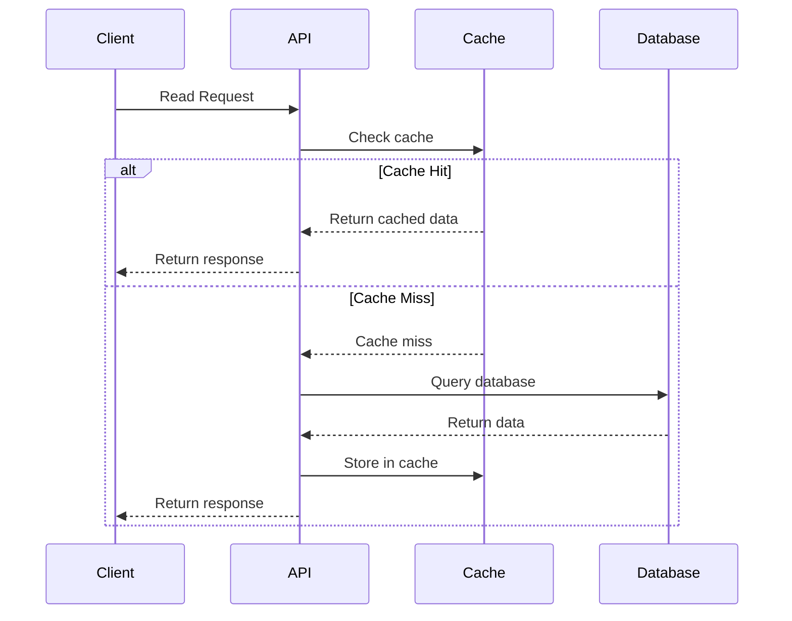
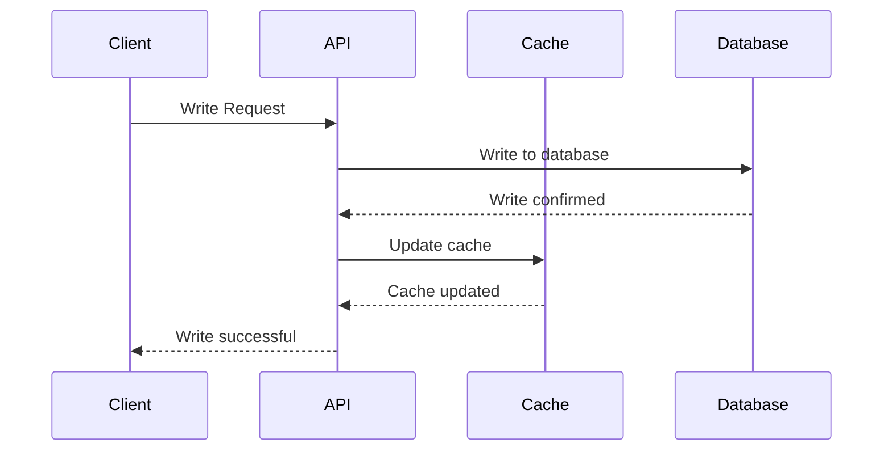
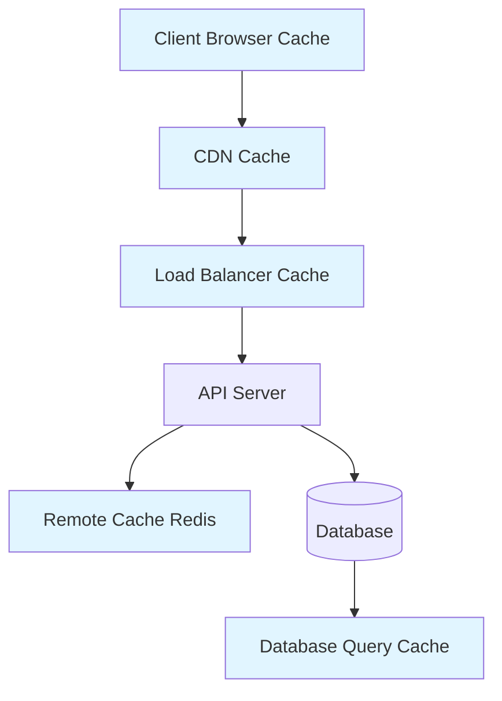
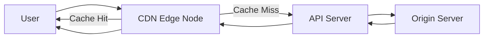
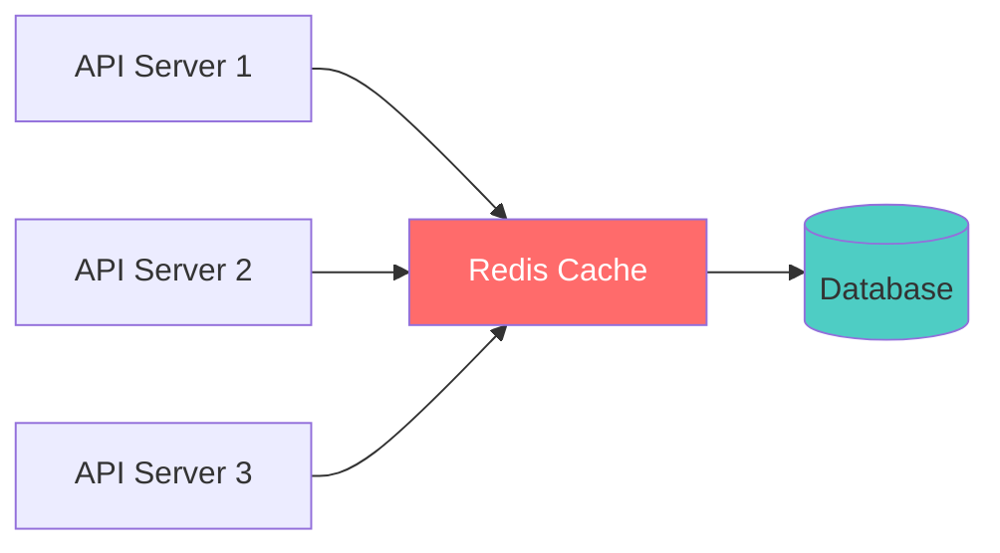

## Caching

Caching refers to storing data in a place where it can be accessed faster and more cheaply than the original source. Anything that helps avoid an expensive `network I/O`, `disk I/O`, or `heavy computation` can be considered caching.

#### Key Characteristics

- **Fast and expensive**: Caches are fast and often expensive, so we only cache a `small subset of data` that is most likely to be accessed.
- **Not limited to RAM**: Caching is not limited to RAM-based storage. Any storage layer that is closer and avoids expensive operations acts as a cache.
- **Hash table abstraction**: In simple terms, caches are `glorified hash tables`.

#### Real-World Examples

- **Google News**: Most recent articles cached
- **Auth tokens**: Checked on every request
- **Live streams**: Last 10 minutes cached

### Cache Population Strategies

Caching usually happens between the API server and the database. There are two common ways to populate a cache:

#### 1. Lazy Population (Cache-aside)

**Process:**
1. First read from the cache
2. If data is missing, read from DB
3. Store the fetched data in the cache
4. Return the response

**Example:** Caching blog posts

#### 2. Eager Population (Write-through / Write-behind)

**Process:**
- Write to DB and cache in the same API call
- Or proactively push updates to the cache

**Examples:**
- **Cricbuzz commentary**: Written to cache immediately
- **Tweet updates**: Pushed to cache proactively

### Caching at Different Levels

The following diagram shows the caching hierarchy from client to database:

#### 1. Client-Side Caching

- Cache data close to the user (images, JS files, user info)
- Stale data is acceptable for most use cases
- Typically invalidated based on time (TTL)

#### 2. CDN (Content Delivery Network)

- Distributed servers around the world
- Requests are served from the nearest CDN edge node
- Uses lazy population: `user -> CDN -> API -> origin server`
- Improves latency and reduces load on the origin server

#### 3. Remote Cache (Redis)

- External in-memory store shared across servers
- Every key should have an expiration to prevent memory bloat
- Cache size should be small relative to the main database

**Commonly used for:**
- Session caching
- User profile lookups
- Leaderboard data

#### 4. Database-Level Caching

- Database itself maintains small computed values
- Example: Storing and updating a `total_posts` column instead of counting each time

#### 5. Other Caching Layers

Anything with memory can act as a cache:
- Load balancers
- API gateways
- Application-level in-memory structures

### Scaling with Caching

Caching complements other scaling strategies:
- **Vertical scaling**: Reduces load on individual servers
- **Horizontal scaling (read replicas)**: Caches reduce database load by offloading frequent reads
- **Sharding (write scaling)**: Caches help distribute read load

### Important Considerations

#### When to Use Caching

Use caching when:
- It meaningfully reduces load or latency
- Staleness is acceptable for your use case
- The cache hit rate justifies the overhead

#### When NOT to Use Caching

**Important Principle:** `Just because you can cache something, doesn't mean you should.`

Caching is not always the right answer. Avoid caching when:
- Data must always be fresh and accurate
- Cache overhead exceeds benefits
- Cache hit rates are too low to justify the complexity
