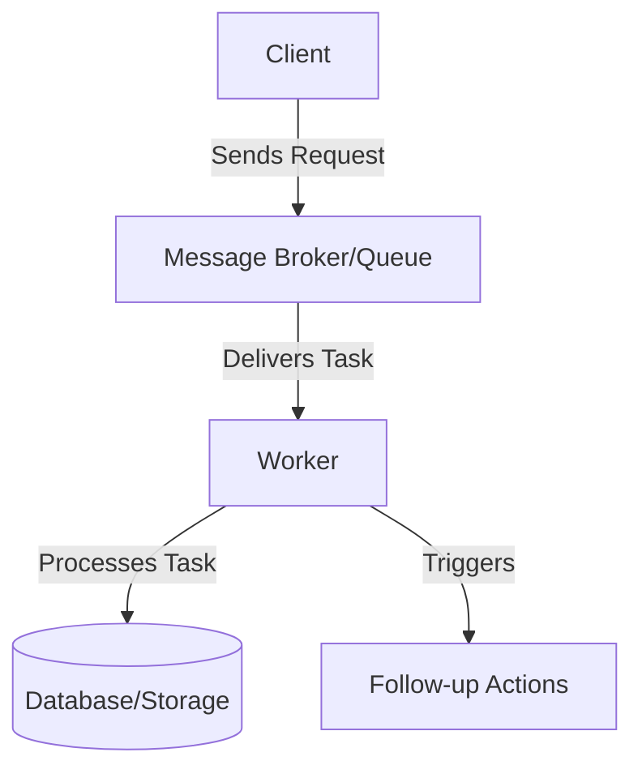
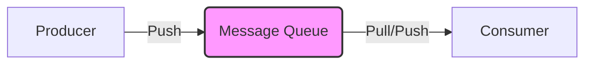
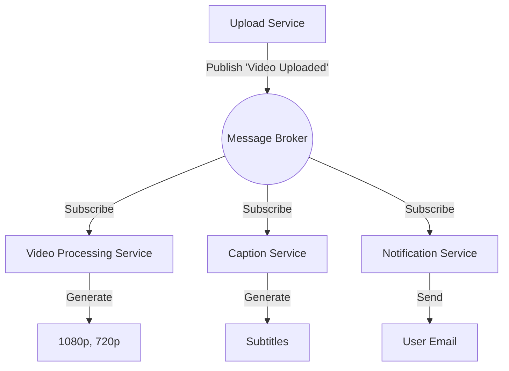
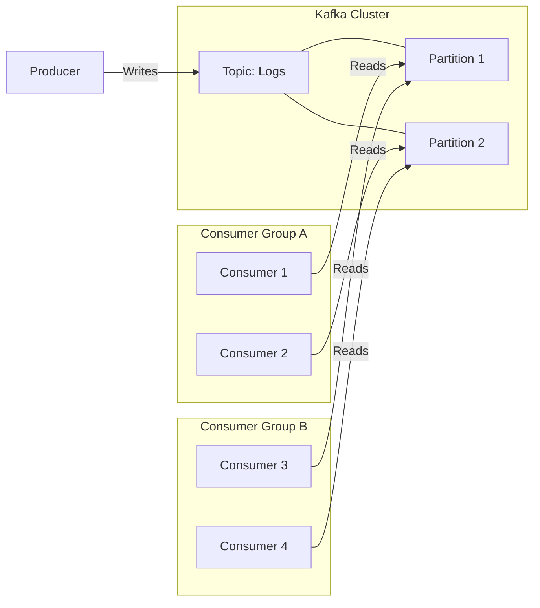
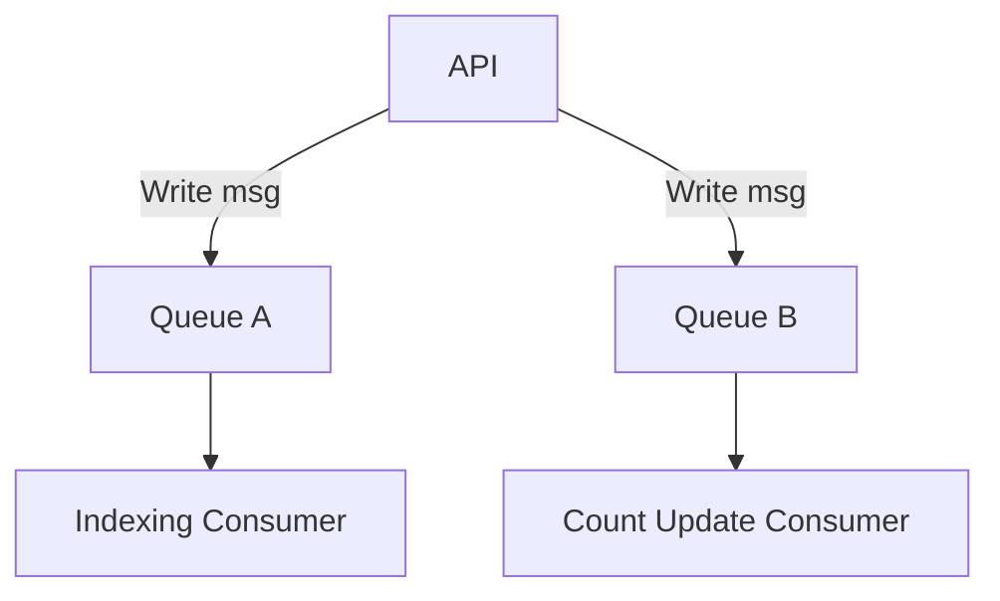
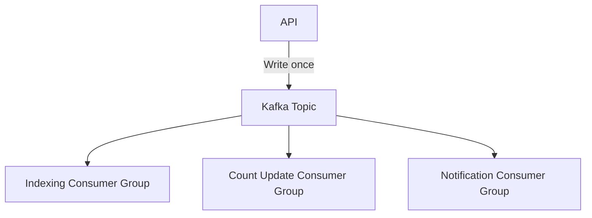

## Asynchronous Processing

Asynchronous processing allows a system to accept a request and return a response `immediately`, while the actual work is performed in the background.
While most `HTTP request-response cycles` are synchronous, modern systems rely heavily on asynchronous pipelines for tasks like notifications, analytics, and background jobs.
Generally, long-running or heavy tasks should not block the main request path (unless they are critical for the immediate user response).

### Why Asynchronous Processing?
Some tasks:
- take too long (e.g., video processing)
- require heavy computation
- depend on multiple machines
- cannot be performed during a live request

These tasks should be delegated to a worker system.

Examples:
- Spinning up virtual machines
- Video transcoding
- Generating captions
- Sending notifications

### Core Components
A typical async system has three parts:

1.  `Client`
    -   Sends the initial request.
    -   Should receive a quick acknowledgment (or rely on polling/webhooks for completion status).

2.  `Message Broker / Queue`
    -   Temporarily stores the task (message).
    -   Acts as a buffer so workers process tasks at their own pace.
    -   Enables loose coupling between services.

3.  `Worker`
    -   Listens to the queue.
    -   Processes tasks asynchronously.
    -   Writes results to the database or triggers follow-up actions.

### Message Queues
Message queues allow two services to communicate `asynchronously` using messages instead of direct calls.

Queues help handle:
- long-running tasks
- background jobs
- tasks across multiple machines
- load spikes

They ensure the main API does not block while heavy work is happening.

### Example: Video Upload + Processing
**Flow**

1.  User uploads a video.
2.  Video upload service stores the video.
3.  It pushes a message (“upload complete”) to the message broker.
4.  The API acknowledges the request (e.g., returns a Job ID) without waiting for processing.
5.  A video-processing service reads the message from the broker.
6.  The worker downloads the video.
7.  It generates processed versions (1080p, 720p, etc.).
8.  Results are stored in DB or storage (e.g., S3).
9.  User sees the “Processing…” state until results are ready.

Another consumer (e.g., captions service) can:
- download the video
- generate captions
- store captions in DB
- enable the “Captions Available” button in UI

In a `Pub/Sub` model, multiple consumers can read the `same message` to perform different tasks. (Note: In a standard `Message Queue`, one message is processed by only one consumer.)

### Message Streams (Kafka)
Kafka is similar to a queue but designed for `high-throughput streaming` use cases.

Key points:
- Kafka stores messages in a `topic`.
- A topic is split into `partitions`.
- Messages within each partition are ordered.
- Consumers read from partitions independently.

**Important limitation:**
In a `single consumer group`, the number of *active* consumers cannot exceed the number of partitions. However, `multiple consumer groups` can read the same topic simultaneously.

## Example: Blog Publishing (Queues vs Streams)

When a blog post is published, multiple background actions may be required:
- indexing the post in Elasticsearch  
- updating the user's total blog count  
- sending notifications  

These can be processed differently depending on whether you use a `Message Queue` or a `Message Stream`.

### Using a Message Queue (e.g., RabbitMQ, SQS)

A queue is typically `one message → one consumer`.  
If we need to perform two independent tasks (indexing + count update):

- Either `one consumer` must do both  
- Or we create `two separate queues` and write the message twice

This creates two failure points.

#### Problems with Queues
1. `Single consumer doing everything`  
   - If indexing fails, the entire message must be retried.  
   - Count update might be done twice (if retries happen).

2. `Multiple queues`  
   - The API server must push the message to *multiple queues*.  
   - If API crashes after writing to Queue A but before Queue B → one consumer gets the event, the other never does.  
   - This causes `inconsistency`.

In short:  
`Queues are not ideal when multiple independent consumers must process the same event.`

### Using a Message Stream (Kafka)

In Kafka:

- The API writes once to a topic.
- Multiple independent consumers (in different consumer groups) read the same event.
- Failure of one consumer does not affect others.
- No risk of partial writes, because the API writes the event only once.

This makes streams ideal for multi-step fan-out workflows.

### Why Streams Work Better Here

- The API performs one write, not multiple.
- Each consumer processes the event at its own pace.
- If indexing fails, only the indexing consumer retries—others continue normally.
- No duplicate work, no lost messages across consumers.